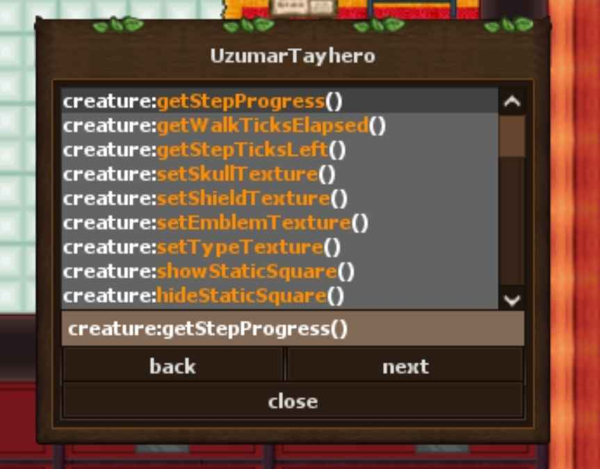
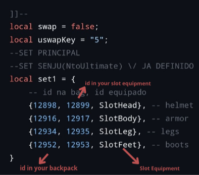

# Free-OtcV8BotScripts
a simple repository for Bot scripts

scripts for [OTClientV8](https://github.com/OTCv8/otclientv8)

- [methods script](/methods.lua)
  - show functions and objects
    
    
    
- [Swap Equipment Se Script](/SwapEquipment.lua)
  - change equip if press button
   
